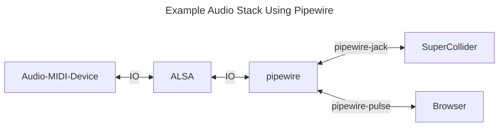
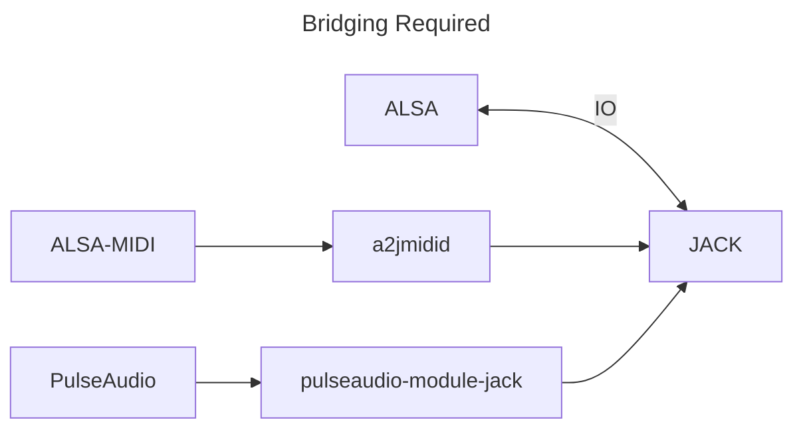

# An Introduction to Pro Audio on Linux for the Recently Initiated

If you are new to making music on Linux, how audio works, how applications are installed and configured, essentially *everything* can be confusing. This document aims to provide a high level overview of the Linux audio technosystem for those new to Linux, but not necessarily to making music.

# Table of Contents

[0. About](#0-about)

[1. How Does My Computer Work?](#1-how-does-my-computer-work)

[2. The Linux Audio System](#2-the-linux-audio-system)

[3. Windows Software/Plugins (bridges)](#3-windows-softwareplugins-bridges)

[4. Audio Software](#4-audio-software)

[5. Audio and MIDI Hardware](#5-audio-and-mIDI-hardware)

[6. CLI Software Tools](#6-cli-software-tools-for-testing-and-configuration)

[7. Setup and Getting to Work](#7-setup-and-getting-to-work)

[Appendix](#appendix)


# 0. About

## What is this document? 

An introduction to professional music and audio production on Linux via high-level overview of audio-centric Linux system components and configurations. Effort has been made to keep this document as concise as possible to reduce friction for the initiate. Lists of software, configurations, and associated programs can be found in the appendix.

### What this document is not

A tutorial, how-to, or troubleshooting guide of, or for any specific topic or flavor of Linux. A good and thorough, though slightly out-of-date explication of the Linux audio stack can be found [here](https://venam.net/blog/unix/2021/02/07/audio-stack.html).

Links to select learning guides and resources are provided in the appendix.

### Why not a guide?

Software changes quickly. High and low level changes happen *all the time*. These are rarely breaking, but sometimes (and especially recently) they are. We are experiencing an epochal shift at the moment away from ALSA+PulseAudio to ALSA+Pipewire. JACK remains constant for the Linux Musician, but it's configuration and use under pipewire is very different than it was previously. In general, the Linux world is one of vast choices. Head over to [DistroWatch.com](https://distrowatch.com/) and page through the different categories from distributions to package management systems and you will quickly understand why a single guide to *anything* Linux is impossible.

### How to use this document

Read it. Any or all of it. If something is incomplete or confusing, let me know or submit a pull request.

# 1. How Does My Computer Work?
 
The following sections will be more or less true for you on capitol "L" Linux. However, as you are probably aware, there are many flavors of Linux, different kernels, different init systems, and many audio servers/mixers that sit on top of the Linux audio stack.

__Takeaway:__ You may need to dig further if any of the components mentioned below are not 100% relevant to you (in other words, if you don't have the program or config file mentioned). Differences in software stacks will mostly affect configurations and configuration file locations. (Or, even whether those configuration files are there to begin with, or must be created by you.)

## 1.a What is a Linux Distribution?

Fedora, Ubuntu, Arch, etc, are Linux distributions (slang -- distros). Distros provide init systems, kernels, window or display managers, and software packaged to work together in a secure and productive way. Your distro will provide updates to your software regularly through their software repositories. (Keeping your system up-to-date is a good idea.) Some distros are designed to be stable (ex. Debian), some to be cutting-edge (ex. Arch.) Your distro will provide a default look-and-feel, but this can be customized.

Most of the time, when you want software, the best way to get it is to use your distro's package management system. Sometimes, however, that is not possible as desired packages might be out of date or unavailable. In these instances, it is possible to install software a number of different ways. Packages can be downloaded and installed from github, via additional PPAs (personal package archives), or directly from a developer's website. 

## 1.b Audio-specific Distributions

Audio-specific distros exist for pro audio production. You do not need to use an audio-specific distro, but they do the tedious configuration for you, saving you a lot of time and effort. For those new to pro audio on Linux, I recommend using one. (See the appendix for a list of audio distributions.) For everyone else, you must choose between stability (and slightly older packages) and bleeding edge (new, but often broken) and customize as you like.

__Takeaway:__ What is available from your distro can be supplemented by audio tuning (configuration) and software (see 1.c below), or you can use a distro that is designed for pro audio first.

## 1.c Audio Software Repositories

There are distributions that also have repositories for their software that can be used on any system. An example is the [KXStudio](https://kx.studio/) repos which can be used on any Debian system to provide both middle and high-level audio utilities, plugins, and standalone programs.

## 1.d The Kernel

This is literal Linux. Everything else sits on top of the kernel and provides the interfaces and software you use. The Linux kernel defines how your OS works to accomplish what it does using your specific computer hardware. 

To record or mix audio, especially with live performance, low system latency is required. Most, if not all, pro audio systems will use either a __real-time__ (RT) or __low-latency__ kernel. This allows the prioritization of audio processes (at the expense of others) to avoid delays in the processing of audio signals. Your distribution should provide one or the other (or more rarely, both.)

__Takeaway:__ You should use a RT or low-latency kernel depending on which is available from your distro (Arch has a real time kernel, Ubuntu only has a low-latency kernel.) If you are a hobbyist, a real-time kernel is probably not necessary and you can get away with some tuning of a low-latency kernel.

## 1.e The Init System

The init system defines how your operating system becomes usable and what parts of the system are activated at what time. For example, part of the initialization is activating network connections. Another is making USB audio devices available to the system. 

The init system spawns and runs some processes as the system, and some can be spawned as the user. This matters because some audio processes can be broken if they are attempted to be used after being initialized the wrong way.

How and when processes (audio and other) start in the boot sequence can determine whether or not you have access to them. This is important if you want to have audio processes or connections happen "automatically" on boot. Typically, this doesn't actually mean "on boot", but rather "on login" for the user. These are very different. A proper systemd overview is in order if that is something you are interested in.

__Takeaway:__ Most popular distros use *systemd* as their init system. Proper configuration of pipewire, wireplumber, and pulseaudio involve working with systemd on most systems. This can be tricky, especially if you are attempting to use pipewire on a system that does not use it by default.


## 1.f Desktop, Window, or Display Manager

This is how your system looks and feels. Plasma is a popular desktop and display management technosystem that follows the general desktop computing paradigm. Also popular now are [tiling window managers](https://wiki.archlinux.org/title/Comparison_of_tiling_window_managers) that provide a more organized, but usually more minimal interface. 

Whether or not your system looks and "acts" like another Linux system is immaterial. Most sit on top of the same audio stack. You can change your desktop/window/display manager as you like *often* but not always without affecting the audio system. An example of losing some audio functionality would be switching your desktop environment from KDE Plasma to i3 where i3 has not been purposefully configured to load things like pavucontrol (see PulseAudio below), leaving your audio system without a proper desktop-level mixer (and you without volume controls).

__Takeaway:__ Customizing your Linux system is part of what makes Linux awesome. Just be aware that changes to how your system looks *can* affect your audio system.

# 2. The Linux Audio System

The following section describes the ways your Linux system *might* handle audio. Typically, pro audio systems are configured to use JACK with PulseAudio and MIDI bridges, or more recently, to use Pipewire and its pulse and JACK interfaces. At the bottom of the stack is ALSA, the part of the Linux kernel that provides drivers for audio hardware. 



## 2.a Kernel level - ALSA

***ALSA*** provides hardware interfacing and device drivers for audio hardware (input and output.) Because it is part of the kernel, ALSA is present on Linux systems. 

ALSA provides device connections (built-in or USB, etc) to *only one client* at a time. This means if you directly choose ALSA as the sound server of choice in your DAW, no other audio sources on your system (ex. Spotify running in a browser) will have access to the audio card. Server/mixers like Pipewire exist to provide broader and more flexible access to hardware and software devices. These server/mixers sit above ALSA in the audio stack.

__Takeaway:__ If ALSA is misconfigured or is not able to provide a driver for an audio device, that device will be unavailable to any server above ALSA like JACK, Pulse or Pipewire. If a device is unavailable (not seen or misconfigured) in Pulse, the problem may be either with Pulse or with ALSA or the device is not compatible with a Linux system. 

## 2.b PulseAudio (server/mixer)

***Pulseaudio*** is a mixer/sound server that sits on top of ALSA and allows multiple programs and system components to access audio IO. Through programs like ***pavucontrol***, PulseAudio also provides configuration of hardware devices (muting, setting volume levels, etc) using computer hardware buttons. 

__Pulseaudio is not a low-latency application and therefore unsuitable for pro audio.__ However, your system probably still uses it for general audio mixing.

__Takeaway:__ Most modern systems, even those that use pipewire as the default audio server, still have PulseAudio or compatibility libraries for it (pipewire-pulse) installed to provide components and GUIs for adjusting volumes, muting channels, and choosing different audio devices without having to edit config files or use the CLI.

## 2.c JACK (server/mixer)

Jack Audio Connection Kit is the OG low-latency audio server/mixer. Most pro audio applications *want* it (ex. Ardour), and some *require* it (ex. SuperCollider). It can be tuned by editing its configuration files (jackd.conf) or using GUIs like such as QJackCTL or QPWGraph.

A modern pro audio setup that does not use pipewire typically consists of JACK running on top of ALSA with PulseAudio and MIDI bridged to it to allow general system programs and devices to work seamlessly with JACK.



If you want to use JACK without pipewire (no longer recommended), you are **strongly** encouraged to add the KXStudio repositories and install [Cadence](https://kx.studio/Applications:Cadence). Cadence can be used to configure JACK and bridge both PulseAudio and ALSA MIDI. Otherwise, you will have to install additional software and correctly create multiple configuration files.

## 2.d PipeWire (server/mixer)

Pipewire is the next generation audio (and video) server for Linux. It unifies handling of JACK and PulseAudio clients through pipewire-jack and pipewire-pulse packages. Applications that expect or require PulseAudio or JACK will work with pipewire via these packages. Pipewire can be configured for low-latency audio either universally or on an application-by-application basis. Configuring pipewire can be challenging, but pipewire documentation is very good and there are plenty of guides (see Appendix). Policy for pipewire is managed by Wireplumber.

__Takeaway:__ Pipewire (pipewire-jack) is flexible and has latency on par with JACK. Configuring it properly requires work. **Ignore old documentation for systems referencing pipewire-media-session which was replaced by wireplumber.**

## 2.e WirePlumber (session manager for pipewire)

Wireplumber manages connections from applications and policy for audio applications (modules) connecting to pipewire. Further:

>One of the components of WirePlumber is the ALSA monitor. This monitor is responsible for creating PipeWire devices and nodes for all the ALSA cards that are available on the system. It also manages the configuration of these devices.

[Source](https://pipewire.pages.freedesktop.org/wireplumber/daemon/configuration/alsa.html)

__Takeaway:__ If ALSA hardware is unavailable in a pipewire connection manager (like qpwgraph) it may be that either ALSA or Wireplumber are misconfigured.

## A Note on JACK and pipewire-jack

JACK (jackd) and pipewire-jack cannot be installed and configured on the same system -- they conflict. If you want to use pipewire, you should install only the packages required by pipewire-jack and create the configuration for jack [according to pipewire](https://docs.pipewire.org/page_man_pipewire-jack_conf_5.html).

## 2.f Groups

When you create an account for yourself on your new Linux OS, your user gets certain privileges by being a member of different groups (who themselves are granted different permissions to access different files, hardware devices, etc). The **sudo** group gives you the privilege of acting like root to, for example, accidentally destroy your operating system. The **plugdev** group gives members the ability to access and use USB devices -- useful for MIDI and audio devices. To see what groups you are a member of, simply run `$groups` at the CLI.

On Debian systems, installing JACK packages creates a file that allows members of the **audio** group realtime privileges. This is necessary to avoid audio glitches (xruns) when recording or when running audio projects or programs with lots of audio processing.

On Arch Linux, one must install the **realtime-privileges** package and then add themselves to the **realtime** group.

__Takeaway:__ Errors when trying to run JACK applications or start JACK via CLI or another program like qjackctl *may* be because of insufficient privileges for the user running the process. Be sure your user is a member of the appropriate "pro audio" group on your system.

# 3. Windows Software/Plugins (bridges)

Native Linux software and plugins work best on Linux. However, it is possible to run Windows software and plugins on Linux using compatibility software. It should be noted, however, that there are limitations to the functionality of some software. Care should be given to researching whether software or plugins are supported by the following applications. See the Windows supported software links in the Appendix.

## 3.a Wine

[Wine](https://www.winehq.org/) is a compatibility layer that allows Windows applications (and plugins) to be run on Linux systems. It is most commonly used with Yabridge to allow the use of Windows VSTs in Linux DAWs. 

## 3.b Yabridge

[Yabridge](https://github.com/robbert-vdh/yabridge) (Yet Another Bridge?) allows windows plugins (windows VST2, VST3, CLAP) to be loaded into DAW projects and plugin hosts as if they were native plugins. There are other bridges. I do not recommend them.

__Takeaway:__ To use windows plugins on a Linux system you will need both Wine and Yabridge configured correctly.

## The MIDI System

MIDI support in the kernel is provided by ALSA. And, like audio, when using a server/mixer above ALSA, MIDI requires a bridge to work the same way audio does.

 MIDI devices must be available and seen by your system in order to be available in your DAW. MIDI endpoints can be seen in programs like __qpwgraph__ just like audio endpoints.
 
MIDI availability largely comes down to system-level and hardware configuration, and less so modern pro audio configuration. See the hardware section below for details.

# 4. Audio Software

There are many lists of free/open source software for Linux. Here we talk only about categories. See the lists in the appendix for specific lists of software and recommendations.

As mentioned above, installation of software via the users OS repositories is usually the *easiest* way to get software. However, depending on the maintainers, software versions may not be recent. Always check the software version in your OS repo against the latest release from the authors to see whether you are missing important features, bug fixes, or stability improvements.

## 4.a DAWs

DAWs used to refer to the entire configuration and interconnection of hardware tools, both audio and MIDI, and the system and software that used them. Now, DAW typically refers to a single piece of software that allows you to record, mix, edit, and produce music (audio and MIDI). Examples include [Reaper](https://www.reaper.fm/) and [Ardour](https://ardour.org/). (See Appendix C for a more complete list.)

DAWs typically, but do not always, come with *some* audio generating and processing plugins. The quality, of which, however, is dubious. Thus, an integral part of DAWs is the ability extend their functionality by hosting other pieces of sound generating and processing software known as plugins. (See below)

## 4.b Audio Trackers

Audio Trackers are a different way of displaying, creating and editing musical information from DAWs. Typically, they scroll top to bottom rather than left-to-right, and data entry is more discrete than in a DAW where there is the illusion of continuous time in the sequencer. Examples include [Renoise](https://www.renoise.com/), [Milky Tracker](https://milkytracker.org/), [SunVox](https://warmplace.ru/soft/sunvox/).

## 4.c Plugins

Part of the creation of music on any system is the recording of audio and the creation of instrumental music using either hardware or software instruments. These are provided in the DAW in the form of plugins that are loaded onto individual tracks or buses to generate or process audio signals. Plugins are architecture specific meaning you cannot use a VST for windows on a Linux system. There are Linux-specific plugins (LADSPA and LV2) and universal plugins (CLAP, VST -- though they have to be compiled specifically for one architecture or another). 

Plugins fit into one of two categories, __instrument plugins__ to generate audio and __DSP plugins__ to process audio. 

Instrument plugins typically model synthesizers or common synthesis processes such as FM or Granular. __Instrument plugins typically take MIDI as input and have audio as output.__ 

DSP plugins are often referred to as "effects plugins" and include common processes like compression, reverberation, or distortion. __DSP plugins take audio as input and have audio as output.__

Plugins are typically created by independent, third party developers, though there are usually plugins bundled with DAW software, the quality of which are questionable.

## 4.d Audio Programming Languages

Experimental computer music and live performance practices including live coding are usually accomplished in an audio domain-specific language (DSL) such as [Csound](https://csound.com/) or [SuperCollider](https://supercollider.github.io/). These programs are available from most distros, but recent versions (esp SuperCollider) may have to be built from source. 

## 4.e Configuration and Audio Routing Utilities

It is possible to configure your Linux system to use different input and output hardware. You can also easily connect hardware device inputs and outputs to multiple software clients as well as route audio from one audio/MIDI program to another. There are many tools for this, but the GUI programs [QjackCt](https://qjackctl.sourceforge.io/) and [qpwgraph](https://github.com/rncbc/qpwgraph) are ubiquitous, up-to-date and well supported.

## 4.f CLI Utilities

Modern general purpose programming languages like Python have extensive audio processing abilities through its vast library (module) system. However, there are command-line tools specifically to process audio files, including batch processing. Examples include [sox](https://archlinux.org/packages/extra/x86_64/sox/) and [ffmpeg](https://archlinux.org/packages/extra/x86_64/ffmpeg/). Programs like SoX also install useful CLI tools like "play" that allow you to 1) very quickly audition sound files from the CLI and 2) display information about the file while you do so.


[libsndfile](https://archlinux.org/packages/extra/x86_64/libsndfile/) is a C library for reading and writing audio files and it too installs a number of very useful programs including sndfile-info which, again, gives you quick and easy insight into the nature of any sound file.

```
nodenoise@nodelap:~/Music/tape$ sndfile-info side_a.aif 
========================================
File : side_a.aif
Length : 63504112
FORM : 63504104
 AIFC
 FVER : 4
 COMM : 64
  Sample Rate : 44100
  Frames      : 4356992
  Channels    : 2
  Sample Size : 16
  Encoding    : sowt => Signed integer (little-endian) linear PCM
 SSND : 17427976
  Offset     : 0
  Block Size : 0
 APPL : 46076024 (too big, skipping)
Request for header allocation of 92152048 denined.

----------------------------------------
Sample Rate : 44100
Frames      : 4356992
Channels    : 2
Format      : 0x10020002
Sections    : 1
Seekable    : TRUE
Duration    : 00:01:38.798
Signal Max  : 28870 (-1.10 dB)
```

__Takeaway:__ If you need to normalize and add fade-ins and fade-outs to 137 audio files you recorded of Blue Whale song, you are better off using a CLI utility than a DAW or high-level program like SuperCollider.

# 5. Audio and MIDI Hardware

Any audio or MIDI interface that is USB class compliant can be used with a Linux system. In many cases, ALSA will make the device available transparently without need for intersession. 

## 5.a Audio Devices

In some cases, especially with large IO (8 in, 8 out) audio interfaces, some configuration will be necessary, either by designating the device as a [pro audio](https://gitlab.freedesktop.org/pipewire/pipewire/-/wikis/FAQ#what-is-the-pro-audio-profile) device in pavucontrol, or by using ALSA UCM to expose all the device input and output channels to the audio server software sitting above it. 

Devices that are not class compliant and that do not have Linux drivers written for ALSA will not be usable on a Linux system. Additionally, even devices that are class compliant (ex. Scarlett 2i2, RME Babyface) will not be able to use any proprietary mixer software that ships with the device as these are invariably Mac/Windows only, and wine does not provide the ability to pass through device controls (hardware.) This means that the class compliant device needs to be able to be fully controlled by the hardware. Some devices have multiple modes they can operate in that render them class compliant (read: controllable via hardware alone.)

## 5.b MIDI Devices

Like audio devices, MIDI controllers connect to the system mostly via USB and are exposed to the system via ALSA. And, like audio devices, MIDI controllers may have proprietary functionality that will not work on a Linux system. A proper example of this is the AutoMap feature built-into Novation MIDI devices. They are not available in AutoMap mode despite being class compliant. Disabling Automap mode makes the hardware usable. 

Further, MIDI devices are extremely customizable and often include multiple mappings (presets) for the control change knobs, faders, and buttons, and even the note-on/note-off keys of the standard MIDI keyboard. Checking what is being communicated from a MIDI device requires use of a utility such as midisnoop. 

# 6. CLI Software Tools for Testing and Configuration

[INCOMPLETE - IN PROGRESS]

Below, where a dollar sign prepends a command, the entire bold sequence must be entered at the command line (CLI). Otherwise, a "normal" standalone program is shown with (GUI) next to it. Using the CLI is empowering and fun. On your Linux system, use your OS launcher and type 'terminal' or search for 'terminal' in your Applications and you will find Terminal, Konsole, xterm, or any number of other terminal emulators.

**rtcqs** (CLI): audio system testing and tuning for pro audio configuration

__MIDI Device Troubleshooting__

**midisnoop** (GUI): MIDI connection testing

**dmesg** and **lsusb**: helpful when diagnosing hardware problems.

### On systems with apt

`$apt-cache rdepends --installed packagename`: lists packages that depend on a given package. 

`$apt-cache depends --installed packagename`: lists dependencies (other required software) of a given package. 

**JACK**
Configuration software: cadence, qjackctl
Configuration files: jackd.conf (without pipewire)

**Pipewire/Wireplumber**

Configuration software: wireplumber
Configuration files: wireplumber.conf

**Gotcha:** Sometimes programs are installed by other programs. This is either because they are dependencies of that program, or because a given package installs multiple applications. This can be confusing when looking for conflicting packages or updates to a program where the package name for said program differs from the program itself. An example is the alsa-utils meta package which installs a number of programs including aplay, alsamixer, alsactl, amidi, alsa-info, [etc](https://archlinux.org/packages/extra/x86_64/alsa-utils/)*.

*Click where it says "View the file list for alsa-utils" under package contents. Everything installed to /usr/bin/ is an application. Everything installed to /usr/lib/ is a ... library. See [here](https://refspecs.linuxfoundation.org/FHS_2.3/fhs-2.3.html) to learn more about where executable programs, libraries, and other software are typically installed on a Linux system. 

# 7. Setup and Getting to Work

Below are an overview of steps one might take to tune their system for pro audio. Again, this is not a how-to, but a set of steps to follow using reasonable sources for precisely how to do the install/configuration.

## 7.a Sane Audio Tuning Strategy

0. **Start with professional hardware**. Built-in audio cards do not provide a low-latency or high-quality experience. Similarly, even low-spec modern laptops are typically able to handle reasonably complex DAW projects without too much effort. However, RAM and CPU architecture *do* matter at the low-end where older i3 chips and 2-4GB of RAM may see you with latency/glitch problems related to low RAM and scheduling bottlenecks.
1. **Start from scratch**. (if system is currently broken, purge all configs or start with a fresh install)
2. **Install an rt or low-latency kernel** -- whichever is available on your system.
3. Install a **CPU management application** to allow setting the processor to a power setting or follow instructions here: https://wiki.linuxaudio.org/wiki/system_configuration#do_i_really_need_a_real-time_kernel
4. **Install pipewire, pipewire-jack, and wireplumber** (if they are not already installed) in the best way for your system and enable them. Currently, Ubuntu-based distros will require the [upstream](https://pipewire-debian.github.io/pipewire-debian/) package for 1.0+ pipewire (required!)
5. Using a low-latency USB audio device (ex Scarlett 2i2, RME Babyface) be sure to **designate the device as a "pro audio" device** using pavucontrol or by setting using ALSA UCMs [(See here)](https://www.scottericpetersen.com/multichannel-audio-devices-and-linux-not-a-love-story/).
6. If necessary to reduce latency, create a [pipewire policy for JACK](https://docs.pipewire.org/page_man_pipewire-jack_conf_5.html) to lower the latency/quantum. 
7. Download and run [rtcqs](https://github.com/autostatic/rtcqs) to make sure your setup is sane and working and all desired mitigations are en/disabled.
8. Install the audio software of your choice. Try to use packages provided from your maintainers, or trusted sources (PPAs update well, or get direct from the author via GitHub or their website.)  See Appendix B for lists of software.

## 7.b Best Practices

**When recording:**

- If using a laptop, plug laptop into power source (but check this to make sure ungrounded power source does not introduce hum on system)
- Close all programs that are either RAM or CPU intensive (or just all of them)
- Turn off antivirus (might initiate a scan during recording)
- Turn off backups (might initiate a backup during recording)
- Turn off notifications which grab both the video and audio thread
- Quit KDE Connect if you use it (your phone notifications will pop-up on your desktop)
- Turn off wi-fi
- Chuck your smartphone in the trash. (okay, this isn't necessary, but it is a good idea.)

**For listening/mixing:**

- Do *not* use Bluetooth audio devices

**For both:**

- Use dedicated, wired hardware for recording and monitoring
- Use high-quality cables, speakers, headphones, microphones, etc.

# Appendix

## a. Guides and Introductions (In No Particular Order) [INCOMPLETE - IN PROGRESS]

### Guides

__Arch Wiki Guide to Pro Audio__ 

The Arch Wiki is *the authority* and a wonder of the modern web. It is written for Arch Linux, but the truths it contains are universal. 

https://wiki.archlinux.org/title/Professional_audio#PipeWire-only

__Configuring Pro Audio on Debian Systems:__

https://github.com/chmaha/DebianProAudio

__Configuring Pro Audio on Arch Systems:__

https://github.com/chmaha/ArchProAudio

https://wiki.archlinux.org/title/Professional_audio

__Configuring Pipewire__

https://github.com/mikeroyal/PipeWire-Guide?tab=readme-ov-file

### Misc

__Overview of ALSA, Pulse__

https://thelinuxcode.com/guide_linux_audio/

__Understanding MIDI on Linux__

http://www.tedfelix.com/linux/linux-midi.html

__Accounting for Latency in Ardour:__

https://manual.ardour.org/synchronization/latency-and-latency-compensation/

__Hardware Compatibility (audio interfaces)__

https://interfacinglinux.com/linux-compatible-audio-interfaces/

__SoX Tutorial__

https://madskjeldgaard.dk/posts/sox-tutorial-cli-tape-music/

### Windows Software on Linux

__Using Wine__

https://wine.htmlvalidator.com/essays-on-understanding-and-using-wine.html

__Configuring Yabridge__

https://github.com/robbert-vdh/yabridge

__Yabridge plugin compatibility__

https://github.com/robbert-vdh/yabridge?tab=readme-ov-file#known-issues-and-fixes

## b. Software Lists [IN PROGRESS]

__Audio Specific Linux Distributions__

https://wiki.linuxaudio.org/apps/categories/distributions

__Open Source Audio Plugins and Apps__

https://github.com/webprofusion/OpenAudio

__A curated list of music DSP and audio programming resources__

https://github.com/olilarkin/awesome-musicdsp

## c. Web Communities [IN PROGRESS]

__Linux Musicians__

https://linuxmusicians.com/

__Reddit Linux Audio__

https://www.reddit.com/r/linuxaudio/

## d. Working with Files (Configuration Gotchas) [IN PROGRESS]

This doesn't have a logical home in the body of this document, but when configuring a system for pro audio, there are some common gotchas that crop up and can be found in guides and troubleshooting docs all over. Here are a few for completeness.

### Paths and config file priority
Programs, daemons, etc, will look for user-specific config files before defaulting to system-level locations. 

**Gotcha:** On different distributions, the config files for a given program will have different user-space paths.

**Gotcha:** Some software does not use user-space configs at all. Configuring these programs requires you to edit system level (ex. /etc/...) files.

**Gotcha:** Some software does not install a config file at all -- one must be created before it can be populated. Sometimes a quick duckduckgo search will reveal sample configurations which may or may not be appropriate for one's use case.

**Gotcha:** The configuration for one program (ex. pipewire) might be affected by the configuration of another program (wireplumber). In most instances, this should be clear from the functionality and architecture of the software, but it can be transparent.
